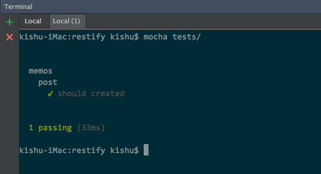
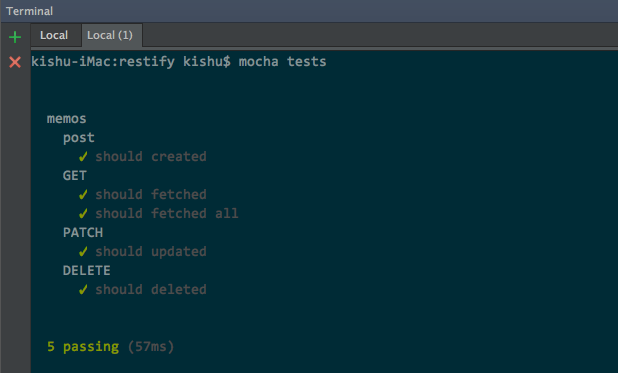

> See [Get Started](./GETSTARTED.md) First

### directories
```
restify
  ├─ /models
  │     └─ memo.model.js
  ├─ /tests
  │     └─ memo.test.js
  └─ app.js
```

> 예제로 사용한 파일들은 https://github.com/kishu/restify-sample 에서 확인 할 수 있습니다.

### node modules 설치
```bash
npm install mocha -g
npm chai chai-http
```

### tests/memo.test.js
```javascript
"use strict";
const chai = require("chai");
const chaiHttp = require("chai-http");
const expect = chai.expect;

chai.use(chaiHttp);

describe("memos", () => {
	let memo;
	describe("post", () => {
		it("should created", done => {
			chai
				.request("localhost:8080")
				.post("/api/v1/memos")
				.send({user: "brown", contents: "test memo"})
				.end((err, res) => {
					expect(err).to.be.null;
					expect(res).to.have.status(201);
					memo = res.body;
					done();
				});
		});
	});
});
```

> see more<br>
https://mochajs.org/<br>
http://chaijs.com/<br>
https://github.com/chaijs/chai-http

### run test
```bash
# mocha tests/
```



### test GET
```javascript
describe("GET", () => {
	it("should fetched", done => {
		chai
			.request("localhost:8080")
			.get(`/api/v1/memos/${memo._id}`)
			.end((err, res) => {
				expect(err).to.be.null;
				expect(res).to.have.status(200);
				done();
			});
	});
	it("should fetched all", done => {
		chai
			.request("localhost:8080")
			.get("/api/v1/memos")
			.end((err, res) => {
				expect(err).to.be.null;
				expect(res).to.have.status(200);
				expect(res.body).to.be.an("array");
				done();
			});
	});
});
```

### test PATCH
```javascript
describe("PATCH", () => {
	it("should updated", done => {
		chai
			.request("localhost:8080")
			.patch(`/api/v1/memos/${memo._id}`)
			.send({user: "choco", contents: "updated memo"})
			.end((err, res) => {
				expect(err).to.be.null;
				expect(res).to.have.status(200);
				done();
			});
	});
});
```

### test DELETE
```javascript
describe("DELETE", () => {
	it("should deleted", done => {
		chai
			.request("localhost:8080")
			.delete(`/api/v1/memos/${memo._id}`)
			.end((err, res) => {
				expect(err).to.be.null;
				expect(res).to.have.status(204);
				done();
			});
	});
});
```

